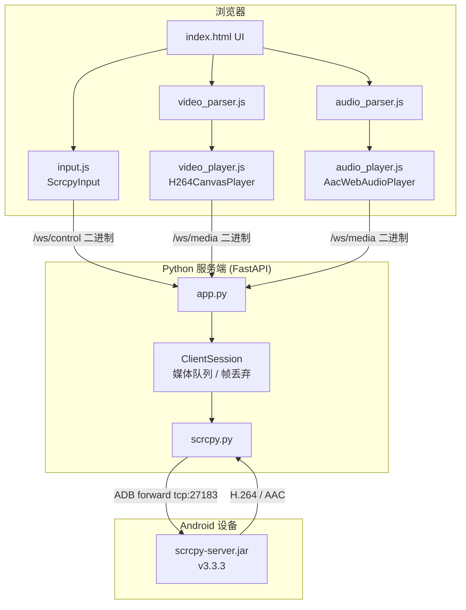

# Web-scrcpy

在浏览器中实时镜像并控制 Android 设备。基于 [scrcpy](https://github.com/Genymobile/scrcpy) 协议，通过 ADB 从手机拉取 H.264 视频流与 AAC 音频流，网页端在安全上下文用 WebCodecs 硬解、否则回退 MSE 软解，支持触控、鼠标、键盘输入与系统导航键。另含隐私伪装门、消息通知红点、多设备礼貌让出、远程唤醒 / 重启等增强，适合把一台常开的安卓机当远程终端。

---

## 目录

- [功能特性](#功能特性)
- [系统架构](#系统架构)
- [环境要求](#环境要求)
- [快速开始](#快速开始)
- [启动参数](#启动参数)
- [画质预设](#画质预设)
- [Web 界面说明](#web-界面说明)
- [浏览器兼容性](#浏览器兼容性)
- [项目结构](#项目结构)
- [通信协议](#通信协议)
- [延迟优化机制](#延迟优化机制)
- [常见问题](#常见问题)
- [多机部署](#多机部署)
- [开发说明](#开发说明)

---

## 功能特性

### 核心能力

| 能力 | 说明 |
|------|------|
| 实时投屏 | H.264 视频流；安全上下文（HTTPS / localhost）用 WebCodecs + Canvas 硬解，否则回退 MSE (JMuxer) |
| 音频映射 | 将手机声音播放到电脑/平板扬声器（AAC 384kbps，Safari 走 AudioWorklet） |
| 触控 / 鼠标控制 | 单击、拖拽、滚轮滚动，坐标自动映射到设备分辨率 |
| 键盘输入 | 桌面端物理键盘映射；移动端唤起本机（iPhone）键盘；长按键盘键可切换手机自带输入法（拼音候选） |
| 系统导航 | 返回、主页、最近任务、音量加减、锁屏 |
| 截屏 | 触发手机系统截屏，图片保存到手机自己的相册 |
| 画质切换 | 原画 / 高清 / 均衡 / 清晰 四档，平滑切换（保留最后一帧），设置持久化到 `localStorage` |
| 自动重连 | 断线、卡顿、解码器卡死、切后台恢复后自动重建连接与解码器（WebCodecs / MSE 均覆盖） |
| 延迟显示 | 顶部状态栏显示 WebSocket Ping RTT（毫秒） |
| PWA 支持 | 可安装为桌面/移动端 Web App，适配安全区域与窗口控件 |

### 远程与隐私增强

| 能力 | 说明 |
|------|------|
| 隐私伪装门 | 移动端打开显示仿 iOS Safari「已丢失网络连接」错误页，需点右下角隐形热区 3 下才进入真实界面；桌面端（有鼠标）自动跳过 |
| 切走即锁 | 移动端切换标签 / 切后台 / 熄屏后立刻盖回伪装页，回来需重新解锁；连接在后台保留，重解锁画面即恢复 |
| 消息通知红点 | 轮询手机通知，QQ / 微信 / Soul 有新消息时悬浮球亮起跑马灯圆环，打开对应 App 后熄灭（锁存：短命通知也不漏） |
| 多设备礼貌让出 | 新设备接管时，旧设备显示「已在其他设备打开」并停止重连，避免两端互相反复顶替；可一键重新接管 |
| 自动息屏 / 锁屏 | 投屏期间不强制唤醒，手机按自己的息屏 / 锁屏设置走 |
| 进入即唤醒 | 解锁伪装门进入时用 adb 唤醒手机；若在锁屏则直接调出 PIN 输入界面 |
| 远程重启 | 诊断面板内的「重启手机」按钮（二次确认 + 仅 POST，防误触），重启后自动连回锁屏 |
| 连接诊断 | 长按悬浮球打开诊断面板，列出最近的连接 / 重连 / 断开事件（含关闭码），可一键复制排障 |

### 界面布局

- **桌面端**：顶部工具栏 + 居中设备边框 + 底部系统导航栏（与画面同宽）
- **移动端（≤768px）**：画面居中铺满，右下角**悬浮球**点开工具面板（5×2 网格），长按打开诊断面板

> **桌面 vs 移动的判定**依据「主指针是否为鼠标」（`pointer: fine`），不是窗口宽度——把电脑窗口缩到很窄仍算桌面端。

---

## 系统架构



### 数据流简述

1. **启动**：服务端通过 ADB 将 `scrcpy-server` 推送到手机，建立 `tcp:27183 → localabstract:scrcpy` 端口转发，拉起设备端 Server 进程。
2. **视频**：设备 → Python 线程读取 socket → 异步队列（满时丢弃旧视频帧）→ WebSocket 二进制帧 → 前端 `VideoParser` 解包 → `H264CanvasPlayer` 解码到 Canvas。
3. **音频**（可选）：设备 AAC 流 → 同样经 WebSocket 转发 → `AudioParser` → `AacWebAudioPlayer`（WebAudio）播放。
4. **控制**：浏览器 `ScrcpyInput` 将触控/按键序列化为 scrcpy 控制消息 → `/ws/control` → Python 线程写入 control socket → 设备。

### 双 WebSocket 设计

| 通道 | 路径 | 用途 |
|------|------|------|
| 媒体 | `/ws/media` | 视频/音频二进制流、会话令牌下发、心跳 |
| 控制 | `/ws/control?token=…` | 输入事件低延迟直传，与媒体流分离 |

媒体连接成功后服务端返回 `session.token`，前端再建立控制连接并校验 token，避免控制通道被无关客户端占用。

---

## 环境要求

### 硬件与系统

- 一台已开启 **USB 调试** 的 Android 设备（或已通过 ADB 连接的模拟器）
- 运行服务端的电脑：**Windows**（项目默认查找 `adb.exe`）
- USB 数据线，或已配对的无线 ADB

### 软件依赖

| 组件 | 版本 / 说明 |
|------|-------------|
| Python | 3.9+ 推荐 |
| FastAPI + Uvicorn | 见 `requirements.txt` |
| adb | 需放在项目根目录，或通过 `--adb_path` 指定 |
| scrcpy-server | **v3.3.3**，文件名为 `scrcpy-server`（无扩展名），放在项目根目录 |

### 获取 scrcpy-server

从 [scrcpy releases](https://github.com/Genymobile/scrcpy/releases/tag/v3.3.3) 下载对应包，解压后将 `scrcpy-server`（或 `scrcpy-server.jar` 重命名）放到项目根目录，与 `app.py` 同级。

```
web-scrcpy/
├── adb.exe              ← 必需
├── scrcpy-server        ← 必需（v3.3.3）
├── app.py
├── scrcpy.py
└── ...
```

### 浏览器要求（客户端）

- **推荐**：Chrome / Edge 90+、Firefox 90+（完整 WebCodecs 支持）
- **Safari / iOS**：支持 WebCodecs 视频；音频在 HTTPS 下使用 AudioWorklet，HTTP 下使用缓冲调度
- 不支持 WebCodecs 时自动降级到 **JMuxer + MSE**（`<video>` 标签播放）

---

## 快速开始

### 1. 安装 Python 依赖

```bash
pip install -r requirements.txt -i https://pypi.tuna.tsinghua.edu.cn/simple
```

### 2. 连接 Android 设备

```bash
adb devices
```

确认列表中出现 `device` 状态。若多台设备，记下序列号。

### 3. 放置必需文件

将 `adb.exe` 和 `scrcpy-server`（v3.3.3）放到项目根目录。

### 4. 启动服务

**HTTP（默认）**

```bash
python app.py
```

**HTTPS（一条命令，推荐 Safari / 手机访问）**

```bash
python app.py --https
```

加 `--https` 后会自动：

1. 检测并安装 `cryptography`（缺失时用清华源 pip 安装）
2. 在 `certs/` 生成包含本机局域网 IP 的自签名证书（无证书或 IP 变化时自动重建）
3. 以 HTTPS 启动，终端会打印 `https://<局域网IP>:5000` 访问地址

默认监听 `http://0.0.0.0:5000`；`--https` 时为 `https://0.0.0.0:5000`。

多设备时指定序列号：

```bash
python app.py --https --device_serial YOUR_DEVICE_ID
```

### 5. 打开浏览器

- HTTP：`http://localhost:5000`（局域网：`http://<电脑IP>:5000`）
- HTTPS：`https://localhost:5000`（局域网：启动日志里会打印 `https://<电脑IP>:5000`）

首次 HTTPS 访问浏览器会提示证书不受信任（自签名），选择「继续访问」即可。iPhone Safari 需在警告页点「显示详细信息」→「访问此网站」。

首次使用若开启了声音映射，**点击画面一次**以解锁浏览器音频（尤其 Safari / iOS 要求用户手势；HTTPS 下可启用 AudioWorklet，音质更好）。

---

## 启动参数

```bash
python app.py [选项]
```

| 参数 | 默认值 | 说明 |
|------|--------|------|
| `--host` | `0.0.0.0` | 绑定地址 |
| `--port` | `5000` | 监听端口 |
| `--adb_path` | `./adb.exe` | ADB 可执行文件路径 |
| `--device_serial` | 自动 | 目标设备序列号；多台设备时必须指定 |
| `--local_port` | `27183` | ADB 本机转发端口；同一电脑多实例并行时每个进程必须不同 |
| `--auto_lock` / `--no-auto_lock` | 开启 | 浏览器断开或离开页面时，是否自动锁屏（会话结束时服务端执行） |
| `--turn_screen_off` / `--no-turn_screen_off` | **开启** | 连接成功后手机熄屏，浏览器仍可正常看到并控制画面；加 `--no-turn_screen_off` 保持手机亮屏 |
| `--https` / `--no-https` | 关闭 | 启用 HTTPS；无证书时自动生成局域网自签名证书 |
| `--ssl_certfile` | — | 自定义 TLS 证书 PEM（与 `--ssl_keyfile` 成对使用） |
| `--ssl_keyfile` | — | 自定义 TLS 私钥 PEM |
| `--tls_domain` | — | 加入自动证书的域名（可重复），如 `--tls_domain scrcpy.test.com` |
| `--video_bit_rate` | `2500000` | 默认视频码率（bps），可被画质预设覆盖 |
| `--max_size` | `800` | 默认长边最大分辨率（像素） |
| `--max_fps` | `25` | 默认最大帧率 |

### WebSocket 查询参数（`/ws/media`）

| 参数 | 说明 |
|------|------|
| `audio_enabled` | `true` / `false`，是否启用音频流 |
| `quality` | `clear` / `balanced` / `smooth` |
| `video_bit_rate` | 自定义码率（覆盖预设） |
| `max_size` | 自定义分辨率上限 |
| `max_fps` | 自定义帧率上限 |
| `device_serial` | 设备序列号（服务端 API 支持，前端默认使用 CLI 指定设备） |

### HTTPS 说明

```bash
# 最简：自动装依赖 + 自动生成证书 + HTTPS 启动
python app.py --https

# 域名访问（自签名，需浏览器接受警告）
python app.py --https --tls_domain scrcpy.test.com

# 使用自己的证书（例如 Let's Encrypt / 公司证书）
python app.py --ssl_certfile fullchain.pem --ssl_keyfile privkey.pem
```

- 自动证书保存在 `certs/web-scrcpy.crt` 与 `certs/web-scrcpy.key`（已加入 `.gitignore`）
- 本机 IP 或 `--tls_domain` 变化、证书临近过期（14 天内）时会自动重新生成
- 前端 WebSocket 会随页面协议自动使用 `wss://`（无需额外配置）
- **域名 + HSTS**：若该域名以前用过正规 HTTPS，浏览器会强制 HSTS，自签名证书可能无法点「继续访问」。需在 Edge 打开 `edge://net-internals/#hsts` 删除该域名，或改用 Let's Encrypt 等受信任证书
- 多实例示例：`python app.py --https --port 5001 --local_port 27183 --device_serial PHONE_A`

### HTTP API

| 端点 | 说明 |
|------|------|
| `GET /` | Web 控制界面（响应带 `no-store`，避免 iOS Safari 缓存旧页面） |
| `GET /api/devices` | 返回已连接 ADB 设备列表 `{"devices": [...], "raw": "..."}` |
| `GET /api/screenshot` | 触发手机系统截屏（存到手机相册），返回 `{"ok": true}` |
| `GET /api/wake` | 唤醒手机；若在锁屏则调出 PIN 界面（手机已醒且未锁则跳过） |
| `GET /api/notifications` | 返回 QQ/微信/Soul 消息红点状态与屏幕是否亮着 `{"alert", "packages", "foreground", "awake"}` |
| `GET /api/ime?on=0\|1` | 切换手机自带屏幕输入法是否弹出（`show_ime_with_hard_keyboard`） |
| `POST /api/reboot` | 远程重启手机（仅 POST，防误触） |
| `GET /static/...` | 静态资源 |
| `WS /ws/media` | 媒体 WebSocket（顶替旧会话时对旧连接发关闭码 `4009`） |
| `WS /ws/control?token=…` | 控制 WebSocket（控制消息为二进制；文本 `ping` / `suppress-lock`） |

---

## 画质预设

界面与 `localStorage` 中保存画质选项，切换后自动重连生效。

| 预设 | 码率 | 分辨率上限 | 帧率 | 适用场景 |
|------|------|------------|------|----------|
| **原画** `clear` | 5.0 Mbps | 1920p | 30 fps | 本机 / 局域网 WebCodecs 硬解，追求清晰 |
| **高清** `hd` | 3.0 Mbps | 1280p | 30 fps | 较好的网络 |
| **均衡** `balanced` | 2.0 Mbps | 800p | 30 fps | 默认推荐 |
| **清晰** `smooth` | 1.2 Mbps | 720p | 30 fps | 弱网 / 远程 / MSE 软解（原画、高清在 MSE 下易卡） |

前端还会按预设调整解码队列深度、过期帧丢弃阈值等参数，与后端视频队列协同降低延迟。

> 提示：iPhone/电脑通过 IP + HTTP 访问时**不是安全上下文**，浏览器禁用 WebCodecs、回退 MSE 软解，此时**别用原画/高清**（1080p+ 的 H.264 MSE 软解容易卡死）；用「均衡」或「清晰」。想让远程也用上硬解，需开启 HTTPS（见 [HTTPS 说明](#https-说明)）。

---

## Web 界面说明

### 工具栏（桌面端在顶部，移动端在悬浮球点开的面板里，5×2 网格）

第一行：原画 · 高清 · 均衡 · 清晰 · 键盘  
第二行：声音 · 音量+ · 音量- · 截屏 · 锁定

| 控件 | 功能 |
|------|------|
| 连接状态芯片 | 显示连接中 / 已连接 / 重连中 / 离线 |
| 延迟 | WebSocket Ping 往返时延（ms） |
| 画质分段按钮 | 原画 / 高清 / 均衡 / 清晰 |
| 键盘 | **短按**：开关本机（iPhone）键盘；**长按**：开关手机自带输入法（两者独立，可同时开） |
| 声音开关 | 开启后手机音频映射到本机 |
| 音量 ± | 发送 Android 音量键 |
| 截屏 | 触发手机系统截屏，存到手机相册 |
| 锁定 | 发送电源键锁屏 |

### 悬浮球（移动端）

- **点击**：展开 / 收起工具面板
- **长按**：打开连接诊断面板（内含最近事件日志、复制按钮、**重启手机**按钮）
- 有新消息时（QQ/微信/Soul）亮起彩虹跑马灯圆环
- 可拖动，位置记忆到 `localStorage`

### 底部导航栏

| 按钮 | Android KeyCode |
|------|-----------------|
| 返回 | 4 (BACK) |
| 主页 | 3 (HOME) |
| 最近任务 | 187 (APP_SWITCH) |

### 本地持久化（`localStorage`）

| 键名 | 说明 |
|------|------|
| `audioEnabled` | 声音开关，默认 `true` |
| `keyboardEnabled` | 本机键盘开关（桌面端） |
| `inputMode` | 输入方式：`local`（本机键盘）/ `device`（手机输入法） |
| `qualityPreset` | 画质预设，默认 `balanced` |
| `fabToolsPos` | 悬浮球位置 |

---

## 浏览器兼容性

### 视频播放

| 环境 | 方案 |
|------|------|
| Chrome / Edge / Firefox（桌面） | WebCodecs `VideoDecoder` + Canvas |
| 不支持 WebCodecs | JMuxer + Media Source Extensions |
| Safari / iOS | WebCodecs（可用时） |

### 音频播放

| 环境 | 方案 |
|------|------|
| Chrome / Firefox / Edge | WebCodecs `AudioDecoder` + 按帧调度播放（1024 samples/chunk） |
| Safari HTTPS | AudioWorklet（`audio_pcm_worklet.js`） |
| Safari HTTP | 环形缓冲 + 小块调度（Worklet 需安全上下文） |
| Android 移动浏览器 | JMuxer 元素播放 |
| WebCodecs 不可用 | JMuxer |

> **注意**：Safari 上项目刻意不走 JMuxer 音频路径（音质较差）。HTTP 环境下请接受缓冲模式，或配置 HTTPS 以启用 AudioWorklet。

---

## 项目结构

```
web-scrcpy/
├── app.py                      # FastAPI 服务：WebSocket、会话管理、媒体队列
├── scrcpy.py                   # ADB / scrcpy-server 生命周期、socket 读写
├── requirements.txt            # Python 依赖
├── templates/
│   └── index.html              # 单页应用：UI、连接逻辑、协议解析入口
├── static/
│   ├── js/
│   │   ├── video_parser.js     # scrcpy 视频包解析（设备名、分辨率、NALU）
│   │   ├── video_player.js     # H264CanvasPlayer（WebCodecs 低延迟播放）
│   │   ├── audio_parser.js     # scrcpy 音频包解析（AAC / ASC）
│   │   ├── audio_player.js     # AacWebAudioPlayer（跨浏览器音频）
│   │   ├── audio_pcm_worklet.js# Safari AudioWorklet 处理器
│   │   ├── input.js            # ScrcpyInput（触控、鼠标、键盘、滚轮）
│   │   ├── h264-sps-parser.js  # H.264 SPS 解析
│   │   ├── exp-golomb.js       # 指数哥伦布解码
│   │   ├── jmuxer.min.js       # MSE 降级播放器
│   │   └── socket.io*.js       # 遗留依赖（当前使用原生 WebSocket）
│   ├── icons/                  # PWA / Favicon 图标
│   ├── css/
│   └── site.webmanifest        # PWA 清单
└── scripts/
    └── gen_icons.py            # 从品牌图形生成多尺寸 PNG/ICO
```

---

## 通信协议

### 媒体 WebSocket 二进制帧

服务端发送的每个逻辑包格式：

```
[type: u8][length: u32 BE][payload: length bytes]
```

| type | 含义 |
|------|------|
| `1` | 视频数据（payload 前 8 字节为服务端发送时间戳 ms，其后为 scrcpy 视频流原始数据） |
| `2` | 音频数据（scrcpy 音频流原始数据） |

文本消息：

- 客户端发送 `ping` → 服务端回复 `pong`（用于延迟测量与保活）
- 服务端连接后发送 JSON：`{"type":"session","token":"…", "audio_enabled":…, …}`

### 控制 WebSocket

- 仅传输 **二进制** scrcpy 控制消息（由 `input.js` 生成）
- 必须通过有效 `token` 关联到当前媒体会话

### scrcpy 设备端参数（`scrcpy.py`）

启动时向设备注入的关键参数：

```
tunnel_forward=true
audio=true|false
audio_codec=aac
audio_bit_rate=384000
video_bit_rate=…
max_size=…
max_fps=…
video_codec_options=profile=1,level=256,i-frame-interval=1
power_off_on_close=false
stay_awake=false
clipboard_autosync=false
```

> `stay_awake=false`：投屏期间不强制唤醒，让手机按自己的息屏 / 锁屏设置走（配合 `/api/wake` 在进入时唤醒并跳 PIN）。注意熄屏锁屏后 Android 11 会切断音频抓取，需解锁后恢复。

ADB 本地转发端口默认 `27183`，可通过 `--local_port` 配置。多实例并行时每台手机使用不同值。

---

## 延迟优化机制

### 服务端（`app.py`）

- 视频队列上限 **6 帧**，满时丢弃最旧视频包，优先保留最新画面
- 音频队列上限 **150 包**，必要时让位给音频连续性
- 视频包附带 **服务端毫秒时间戳**，供前端统计（当前 UI 仅显示 Ping RTT）
- 会话替换时串行关闭旧会话、`preclean` ADB 转发与设备端进程，减少僵尸连接

### 客户端

- `H264CanvasPlayer` 限制解码队列深度，过期帧主动丢弃
- 卡顿检测：无新帧 / 无新包超时自动 `forceReconnect`
- 切后台：隐藏超过 4s 强制重连；回到前台防抖恢复
- 双通道 keepalive + 指数退避重连

---

## 常见问题

### 找不到设备

```bash
adb devices
adb kill-server && adb start-server
```

确认手机上已授权 USB 调试，数据线支持数据传输。

### 提示找不到 adb 或 scrcpy-server

- `adb.exe` 放在项目根目录，或 `python app.py --adb_path "C:\path\to\adb.exe"`
- `scrcpy-server`（v3.3.3）放在项目根目录，文件名必须为 `scrcpy-server`

### 多台设备连接失败

```bash
python app.py --device_serial <序列号>
```

也可先调用 `GET /api/devices` 查看列表。

### 有画面没有声音

1. 确认工具栏声音开关已开启（默认开启）
2. **点击画面一次** 解锁浏览器音频策略
3. Safari 建议使用 **HTTPS** 以获得更佳音频路径
4. 查看服务端日志是否出现 `audio_codec` 相关 WARNING（设备需输出 AAC）

### 画面卡顿或黑屏

- 切到「清晰」或「均衡」降低码率——**远程 / iPhone（MSE 软解）下别用原画/高清**，1080p+ 软解容易卡死
- 手机内存被 App 占满（微信 / QQ 等常驻）会导致编码发涩：清后台，或用诊断面板的「重启手机」偶尔清一下
- 查看顶部是否持续「重连中」——可能是 USB 连接不稳或 scrcpy-server 版本不匹配
- 刷新页面；服务端会自动 `preclean` 后重建会话

### 远程（室外/蜂窝网络）延迟高、只能用低画质

内网穿透（ZeroTier / Tailscale）在国内常打不通直连、经海外中继，延迟高、带宽不稳，高码率档撑不住。属于网络路径限制，非本程序问题。缓解：固定用「清晰」档；有条件可在国内 VPS 自建中继（ZeroTier Moon）就近中转。

### 手机会不会自动锁屏 / 锁屏后怎么进

- 投屏期间**按手机自己的息屏 / 锁屏设置**走（`stay_awake=false`）。若一直不锁，检查手机「开发者选项 → 充电时保持唤醒」是否开着（USB 常插会强制常亮）
- 锁屏后打开网页、解锁伪装门进入时会**自动唤醒并跳到 PIN 界面**（`/api/wake`）
- 锁屏期间音频会中断（Android 11 要求解锁亮屏才能抓音频），解锁后恢复

### 切电脑浏览器标签回来卡一下

已修复：后台标签定时器被浏览器冻结、心跳暂停会被误判为断线。现在改为切回来先探测再决定，健康连接不会被重连打断。

### FLAG_SECURE 黑屏（某些 App / 锁屏投出来是纯黑）

应用给窗口打上 Android 的 `FLAG_SECURE` 后，**系统就不再把该窗口的内容送往任何截屏或外部显示通道**，scrcpy 拿到的只能是纯黑。这是系统级的安全边界，不是本项目的 bug。

常见会黑屏的场景：

| 场景 | 说明 |
| --- | --- |
| **Telegram** | 启用「密码锁」且禁止截屏时，会给所有窗口加 `FLAG_SECURE` |
| **银行 / 支付类 App** | 多数默认开启 |
| **部分 ROM 的锁屏**（如 ColorOS） | 整个锁屏界面都是 secure 层，见下方「锁屏黑屏机型」 |

怎么确认是不是它：

```bash
# 把目标 App 切到前台后执行，输出里出现 SECURE 就是它
adb shell "dumpsys window windows | grep -A 20 'Window{.*<包名>' | grep -E 'Window\{|fl='"

# 交叉验证：手机端截屏若也是纯黑，说明确系 FLAG_SECURE
adb exec-out screencap -p > test.png
```

**解决办法**：

- **在应用自己的设置里关掉**。例如 Telegram：设置 → 隐私和安全 → 密码锁 → 允许「截屏 / Screen Capture」。这是唯一可靠的办法。
- 项目里的 `try_disable_flag_secure()` 会尝试系统级绕过（`screencapture_disabled`、`debug.screencap.secure_layers` 等），但**新版本 Android 已堵死这条路**（实测 ColorOS / Android 16 无效）。
- **不 root 没有可靠的绕过方式**。其余 App 不受影响，只有 secure 窗口本身是黑的。

### 连接时手机熄屏（控制端仍可见）

**默认已开启**：连接成功后手机物理屏幕会熄灭，浏览器里照常看到画面、照常操作（等同 scrcpy `-S`）。

```bash
python app.py
```

若希望 **手机保持亮屏**，启动时加：

```bash
python app.py --no-turn_screen_off
```

可与 HTTPS、多机等参数组合：

```bash
python app.py --https --no-turn_screen_off --device_serial YOUR_DEVICE_ID
```

说明：

- 连接建立后会通过 scrcpy 控制通道关闭设备显示，**不影响视频流**
- 已配合 `stay_awake=true`，避免部分机型休眠断流
- 按手机电源键仍会亮屏；通过网页操作不受影响
- 与 `--auto_lock` 不同：后者是**断开连接时**锁屏，前者是**连接期间**熄屏

### 关闭页面后手机会自动锁屏吗？

默认会。关闭浏览器标签、刷新页面或 WebSocket 断开时，服务端会在会话结束时尝试通过 ADB 锁屏。

若不需要此行为，启动时加 `--no-auto_lock`：

```bash
python app.py --no-auto_lock
```

工具栏上的锁屏按钮仍可手动锁屏，不受此选项影响。

### 切换画质 / 声音后为什么要刷新？

当前实现通过 `location.reload()` 重建 WebSocket 与 scrcpy 会话，以确保编码参数与音频开关完全一致。

---

## 多机部署

同一台服务器控制多台手机：**每台手机单独起一个服务进程，绑定不同 `--device_serial`、`--port` 和 `--local_port`**，浏览器访问不同端口即可分别控制，互不影响。

USB 连接推荐使用 **有源 USB 3.0 集线器**；也可用无线 ADB。完整接线说明、批量启动脚本、端口规划见：

**[docs/MULTI_DEVICE.md](docs/MULTI_DEVICE.md)**

多实例示例：

```bash
python app.py --device_serial PHONE_A --port 5001 --local_port 27183
python app.py --device_serial PHONE_B --port 5002 --local_port 27184
```

---

## 开发说明

### 本地调试

```bash
# 安装依赖
pip install -r requirements.txt -i https://pypi.tuna.tsinghua.edu.cn/simple

# 前台运行（日志输出到终端）
python app.py --port 5000

# 修改前端后刷新浏览器即可；静态资源带版本号 ?v= 防缓存
```

### 重新生成图标

```bash
pip install pillow -i https://pypi.tuna.tsinghua.edu.cn/simple
python scripts/gen_icons.py
```

### 关键扩展点

| 文件 | 扩展方向 |
|------|----------|
| `scrcpy.py` | 新 scrcpy 版本适配、编码参数、设备初始化 |
| `app.py` | 鉴权、多用户会话、录制、转码 |
| `video_player.js` | 解码策略、硬件加速选项 |
| `audio_player.js` | 音频后端、缓冲算法 |
| `input.js` | 新手势、游戏手柄、快捷键 |
| `index.html` | UI、重连策略、设备选择器 |

### 技术栈摘要

- **后端**：Python 3、FastAPI、Uvicorn、threading + asyncio 混合模型
- **前端**：原生 HTML/CSS/JS、WebCodecs API、Web Audio API、WebSocket
- **设备协议**：scrcpy 3.3.3 server（H.264 + AAC）、ADB forward

---

## 致谢

- [Genymobile/scrcpy](https://github.com/Genymobile/scrcpy) — 核心投屏协议与 server
- [WebCodecs](https://www.w3.org/TR/webcodecs/) — 浏览器低延迟音视频解码

---

## 许可证

本项目为 scrcpy 协议的 Web 端实现。使用 scrcpy-server 时请遵循 [scrcpy 项目许可证](https://github.com/Genymobile/scrcpy/blob/master/LICENSE)。本仓库未单独声明许可证文件，分发或商用前请自行确认合规性。
